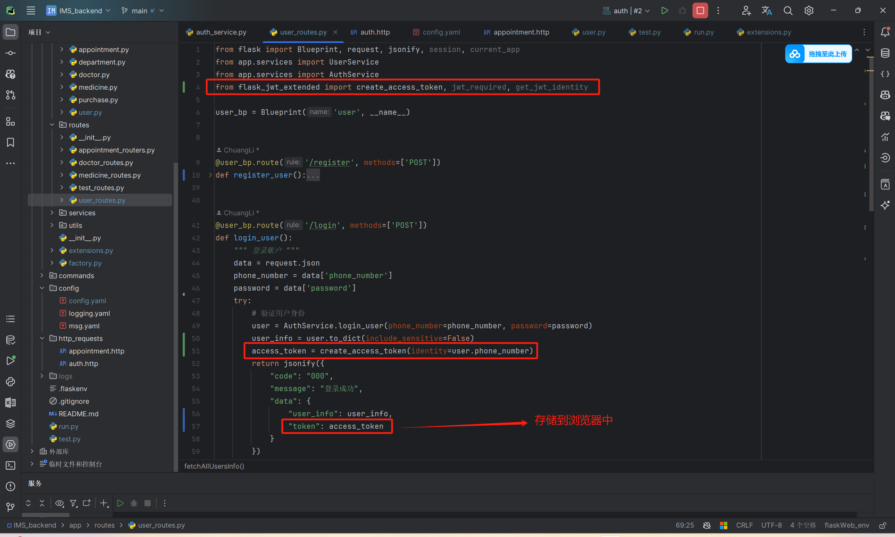

# Delivery-AdminPanel

## 说明

本仓库是管理员面板(面向Web Browser)的上游仓库。

## 运行说明

本项目使用**vue3+Primevue组件库+PrimeIcons图标库**

'git clone'项目后输入如下命令运行项目。
```
# npm运行过慢可配置Taobao镜像cnpm
npm install
npm run dev
```

## 目前大致效果 -- 12月01日

可以从后端获取数据表格数据进行展示


侧边栏实现递归创建


后端加入token验证，具体实验未实装



可以先将这几个界面写好 -- 仿照**视频教程**和**用户管理模块**


